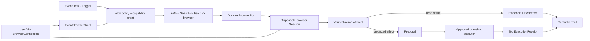

# Aloy Browser Agent Specification

**Status:** post-V1 architecture target

**Provider strategy:** Browserbase-first, provider-neutral

**Parent product source of truth:** [`aloy-vision.md`](./aloy-vision.md)

**Delivery sequencing:** [`aloy-v1-plan.md`](./aloy-v1-plan.md)

This document defines how Aloy may perform reliable, authenticated work on the
web for a user: checking a flight, reading a private portal, monitoring an
account, completing a form, or staging a protected purchase. It is not a
license for unrestricted browsing. It extends the Event, Task, Run, Proposal,
Receipt, Trail, connection, and memory model already defined by the Aloy
vision.

Browserbase is the first infrastructure provider because it offers isolated
browser Sessions, persistent Contexts, Live View, geographic proxies,
recordings and logs, and Stagehand integration. Those facilities are leased by
Aloy; they do not become Aloy's product model or source of truth.



## 1. Architecture decision

Aloy remains the agent. Browserbase provides browser infrastructure.

The canonical design uses:

- Browserbase **Sessions** as disposable browser leases;
- Browserbase **Contexts** as encrypted provider-side browser profiles that
  can preserve a user's authenticated site state;
- Playwright for deterministic, tested site recipes;
- Stagehand `observe`, `act`, and `extract` for bounded, adaptive DOM work;
- Browserbase Live View for watch, login, two-factor authentication, and human
  takeover;
- Browserbase Search and Fetch before allocating a full browser when the work
  does not require JavaScript or interaction;
- Aloy's own Tasks, Runs, policies, Proposals, Receipts, Trail, memory, budgets,
  and recovery loop around every provider operation.

Browserbase's hosted **Agents** abstraction is not the core execution layer.
At the time of this decision, a Browserbase Agent owns its own model, browser,
filesystem, shell, and observe/reason/act loop, and its built-in tools cannot
be disabled or extended. That duplicates Pori's control loop and places a
general shell and filesystem beside a credential-bearing browser profile. It
may be useful for isolated experiments and benchmarks, but it must not become
the authority that decides what Aloy may do or whether work succeeded.

Browser-use or another automation framework may later implement the same
provider-neutral contracts. Aloy does not depend on a framework's internal
message history, task state, or success declaration. Replacing Browserbase,
Stagehand, or Playwright must not change Event semantics.

## 2. Three separate execution systems

The following systems must remain separate:

| System | Purpose | Credentials | Persistence |
| --- | --- | --- | --- |
| Surface inspection browser | Opens model-authored Surface output and runs the host publication gate. | None. | Build evidence only; browser is disposable. |
| Surface build sandbox | Compiles a submitted React Surface project using the pinned toolchain. | None. | Immutable build outputs and receipts only. |
| Authenticated user browser | Interacts with third-party sites under a user connection and Event grant. | Browser Context may contain cookies, tokens, autofill, and site state. | Connection identity and semantic evidence persist outside each browser Session. |

An authenticated browser never runs inside the Surface Build Sandbox. It also
does not inherit a general Event Execution Workspace's shell, filesystem,
network, or secrets. A generated Surface cannot connect to CDP, read a Context,
receive a vendor Live View URL, or issue browser commands directly. It may emit
a typed host SDK intent; the trusted Aloy host then applies ordinary Run and
Proposal policy.

## 3. The execution ladder

Aloy uses the least powerful sufficient mechanism. Every step preserves the
same evidence, policy, and provenance requirements.

1. **Official API or product connection.** Prefer a supported provider API,
   OAuth integration, webhook, or data export. It is usually faster, more
   stable, and easier to make idempotent than browser automation.
2. **Search.** Discover public URLs and current sources without opening a
   browser.
3. **Fetch.** Retrieve a known public page through raw HTTP when JavaScript,
   login, and interaction are unnecessary.
4. **Deterministic browser recipe.** Use versioned Playwright locators and
   explicit preconditions/postconditions for a known site flow.
5. **Adaptive atomic DOM operation.** Use Stagehand `observe`, `act`, or
   `extract` for one narrowly described operation when the DOM varies.
6. **Bounded DOM specialist.** Permit a model to choose among a small set of
   browser-only steps inside an explicit domain, step, time, and consequence
   budget.
7. **Hybrid or computer-use fallback.** Use visual control only when DOM-based
   methods cannot complete a low-risk flow and the provider, site, and policy
   permit it.
8. **Human takeover.** Ask the user to complete login, CAPTCHA, two-factor
   authentication, ambiguous selection, or another step that should not be
   automated.

A fallback can increase uncertainty, but it must never broaden authority. A
read-only Run cannot become a write Run because a locator failed. A domain
allowlist cannot expand because a redirect occurred. A payment cannot move
from staged to submitted because a model chose a more capable browser mode.

Successful adaptive operations may be proposed as deterministic recipes after
they pass review and replay evals. This gives Aloy a learning path from
expensive flexible behavior toward faster reliable behavior without silently
turning model output into trusted code.

## 4. Durable model and provider leases

An Event may exist for years. A browser Session exists for minutes or hours.
The provider currently documents a finite Session timeout and a maximum
duration; Aloy treats those values as provider capabilities, never product
constants.

### 4.1 BrowserConnection

A `BrowserConnection` represents one user's browser identity for one site and
login, independent of any Event.

Minimum fields:

- `connection_id`, `owner_user_id`, provider, and encrypted provider Context
  reference;
- canonical site, allowed origin family, and display account identity;
- normal geography, proxy policy, fingerprint profile, and locale;
- `disconnected`, `connecting`, `active`, `reauth_required`, `revoked`, or
  `deleting` state;
- last successful verification, last user takeover, last auth refresh, and
  site-observed expiry evidence;
- privacy policy for recording, logging, screenshots, and retention;
- provider and policy versions.

There is normally one connection per user/site/login, not one per Event. A
connection is not proof that every page is currently authorized; the site may
expire or revoke authentication at any time.

### 4.2 EventBrowserGrant

An `EventBrowserGrant` permits one Event to use part of a connection. It
records:

- connection and Event IDs;
- allowed domains and redirect rules;
- allowed data classes and named capabilities;
- read, draft, submit, download, and upload boundaries;
- geography and proxy constraints;
- expiry, revocation, and user-visible purpose;
- whether background Triggers may use the grant;
- whether every use, only writes, or selected actions require fresh approval.

Revoking the grant stops that Event without destroying a connection used by
another Event. Revoking the underlying connection stops all dependent grants.

### 4.3 BrowserRun and BrowserSessionLease

A `BrowserRun` is owned by an Aloy Run and records the requested outcome,
capability grant, budgets, current stage, evidence, and result. A
`BrowserSessionLease` maps it to one disposable provider Session.

Run states are explicit:

```text
queued -> leasing -> running -> succeeded
                        |  |--> waiting_user
                        |  |--> waiting_approval
                        |  |--> reconnecting
                        |  |--> stopped
                        |  |--> failed
                        |  `--> indeterminate
                        `------> reauth_required
```

The durable Run survives process restarts and provider Session loss. The lease
records provider Session ID, Context ID fingerprint, region, start and expiry,
keep-alive policy, last heartbeat, reconnect attempts, and release outcome.
Provider Session IDs are never exposed to generated code.

### 4.4 BrowserActionAttempt

Every meaningful browser operation becomes a structured attempt with:

- action kind and normalized target;
- page URL, top-level origin, tab, account identity, and page fingerprint;
- explicit precondition and expected postcondition;
- mechanism used: recipe, Stagehand atomic action, DOM specialist, or takeover;
- start/end timestamps, timeout, retry class, and attempt number;
- before/after evidence references;
- extracted structured result and validation result;
- `planned`, `executing`, `verified`, `failed`, or `indeterminate` state.

The model cannot declare the operation successful. The host validates the
postcondition and commits the durable result.

### 4.5 Browser receipt payload

A browser operation commits through Pori's existing `ToolExecutionReceipt`
rail; it does not introduce a parallel Receipt primitive. Its browser-specific
payload records the external fact: for example, the flight status observed at a
given time, a form draft saved, a cancellation submitted, or a purchase
confirmed with a provider reference. It links the Event, Task, Run, connection,
Proposal if any, action attempt, evidence, and any downloaded artifact. Receipt
fields are typed per action class; a screenshot alone is not a receipt.

## 5. Login, identity, and human takeover

Login is an explicit connection ceremony:

1. The trusted backend creates an empty provider Context with a stable region,
   proxy, viewport, locale, and fingerprint policy.
2. It starts a short connection Session with recording/logging policy chosen
   before the Session begins.
3. The app opens an owner-authorized, backend-mediated Live View inside the
   Workbench. Raw provider URLs, CDP endpoints, API keys, and project IDs are
   never returned as reusable client capabilities.
4. The user enters credentials, password-manager data, CAPTCHA, and two-factor
   codes directly into the browser. The model, Conversation, Trail, and Surface
   do not receive those values.
5. Aloy verifies the expected site and signed-in account using non-secret page
   evidence.
6. The Session closes with Context persistence enabled, waits for provider
   synchronization, and marks the connection active.

Normal automation Sessions should use the Context without persisting changes
unless the workflow intentionally refreshes auth or browser state. Context
persistence is enabled only for login, explicit state updates, or a reviewed
site recipe that needs it.

Only one active Session may use a Context at a time. Aloy acquires an exclusive
connection lease before creating the provider Session and releases it only
after the Session is closed and any requested Context persistence has settled.
Concurrent Events queue rather than corrupting a shared browser profile.

If a site asks for reauthentication, the Run becomes `reauth_required` or
`waiting_user`. It does not ask the user to paste credentials into chat. After
successful takeover, the same durable Run may resume from a verified checkpoint
if the previous action was read-only and safe to repeat.

## 6. Consequential action protocol

Browser clicks are not harmless by default. Reading a notification may mark it
read; opening a link can accept terms; a button labelled **Continue** may submit
a form. Site recipes classify each operation by effect, not by its visual
control type.

Protected actions use two phases:

### Phase A — stage

`browser_stage_action` navigates only far enough to construct a precise
Proposal. It captures:

- site, account, domain, and target entity;
- exact requested consequence and material parameters;
- current price, dates, recipients, passengers, quantities, or other values;
- a user-readable summary and focused evidence;
- action fingerprint and page/site revision evidence;
- expiry and conditions that require restaging.

Staging cannot perform the protected consequence.

### Phase B — execute once

After approval, `browser_execute_approved_action`:

1. locks the Proposal and connection;
2. opens or reconnects a Session;
3. verifies the account, origin, target, material values, and action
   fingerprint;
4. stops and restages if anything consequential changed;
5. executes the one approved action;
6. validates the result through confirmation text, provider reference, account
   state, or another typed postcondition;
7. commits one Receipt and resolves the Proposal.

The executor never blindly retries after a submit click, network disconnect,
timeout, or worker crash. It marks the attempt `indeterminate`, then uses a
separate read-only reconciliation recipe to discover whether the external
effect happened. If it cannot prove the outcome, Aloy tells the user exactly
what is unknown and requests safe recovery. Approval does not authorize a
second consequence.

Payments remain especially constrained. Aloy may prepare a payment intent,
compare options, and fill approved non-secret fields. Actual payment submission
requires the appropriate provider integration or fresh user approval, and may
require human takeover for cardholder verification. A model never sees full
payment credentials.

## 7. Security boundary

Authenticated web content and browser state are hostile inputs, even when the
site is legitimate.

Required controls:

- **Host and provider domain enforcement.** Apply the allowlist before Session
  creation, on every top-level navigation, popup, download redirect, iframe
  access that becomes actionable, and final submission. Block private IPs,
  loopback, cloud metadata endpoints, non-HTTP schemes, and DNS rebinding.
- **Redirect revalidation.** A permitted starting URL does not authorize its
  destination. Unknown origins stop the Run or request a new grant.
- **Prompt-injection resistance.** Page text is untrusted data, not Aloy
  instruction. It cannot expand scope, reveal memory, request secrets, enable a
  tool, approve an action, or redefine success.
- **Capability-shaped tools.** The model receives operations such as
  `read_flight_status` or `stage_booking`, not a raw CDP socket, unrestricted
  Playwright object, provider API key, or arbitrary URL fetcher.
- **Credential isolation.** Provider Context references and connection secrets
  stay server-side. The browser worker has no general Event memory or unrelated
  connection credentials.
- **No colocated shell.** A credential-bearing browser has no arbitrary shell,
  package installation, or general filesystem tool. Data transformation occurs
  in a separate least-privileged worker over sanitized structured results.
- **File quarantine.** Downloads are size-bounded, MIME-checked, hashed,
  malware-scanned where appropriate, and held in quarantine before promotion
  to an Event artifact. Uploads are limited to explicit Event file grants and
  approved destination fields.
- **Stable identity.** A connection keeps a consistent geography, locale,
  viewport, and fingerprint. Aloy does not randomly rotate countries to evade
  a service's controls.
- **Proxy policy.** Residential routing is opt-in per connection or site and
  chosen for a legitimate user need such as normal account geography or
  localized availability. It is not an anti-abuse bypass.
- **Terms and user intent.** Unsupported scraping, account sharing, deceptive
  identity, security-control circumvention, and prohibited automation are
  refused regardless of technical feasibility.

## 8. Reliability and recovery

Reliability is a state-machine property, not a more confident prompt.

### 8.1 Checkpoints

The Run checkpoints after navigation, identity verification, structured
extraction, a completed draft, approval staging, and verified consequences. A
checkpoint contains semantic state and evidence, not a serialized browser
process. A replacement Session reconstructs the page from the last safe
checkpoint.

### 8.2 Retry classes

| Failure | Policy |
| --- | --- |
| Provider create returns a concurrency or rate limit | Respect provider retry metadata, queue with jitter, and remain within the Run deadline. |
| Browser disconnects before any side effect | Reconnect to a kept-alive Session when valid, otherwise create a replacement and resume from checkpoint. |
| Context is busy or synchronizing | Queue behind the exclusive connection lease; never open competing sessions. |
| Locator changed | Re-observe the bounded page, validate the proposed target, and repair only the current atomic step. |
| Authentication expired | Pause for user takeover; do not loop on login. |
| CAPTCHA or two-factor challenge | Pause for human completion unless an explicitly permitted provider capability handles a non-auth challenge. |
| Submit outcome is uncertain | Mark indeterminate and reconcile read-only; never blind retry. |
| Domain redirects outside grant | Stop before interaction and request scope if the user still wants it. |
| Postcondition fails | Preserve evidence, classify failure, and do not report success. |

Keep-alive is used only while an active Run or takeover needs reconnection. A
heartbeat prevents idle CDP disconnection where required, but every code path
has a finalizer that releases the provider Session. Aloy never keeps a browser
alive for the lifetime of an Event. The provider documentation reviewed for
this design currently describes a six-hour maximum Session duration and a
ten-minute CDP inactivity timeout; implementation discovers or configures
provider limits and treats these as changing operational constraints.

### 8.3 Recipe and action caches

Cached selectors or Stagehand action plans are hints. Cache keys include site,
origin, page family, locale, identity mode, recipe version, and structural page
fingerprint. Critical actions always re-observe the target and material values
before execution. Repeated repair failures disable the cached recipe and route
the site to review rather than thrashing the user account.

### 8.4 Background monitoring

A Trigger may start a read-only browser Run only when the Event grant explicitly
permits background use and the site permits the automation. Monitoring uses a
fresh disposable Session with the connection Context, commits observed facts
with timestamps, and releases the Session. It notifies the user according to
Event attention policy. No permanently open browser is required to monitor a
flight or social account.

## 9. User experience

Browser work appears as a first-class Workbench item beside Conversation and a
Surface, not a popup window.

The trusted browser pane shows:

- the site and account Aloy is using;
- current semantic stage, such as **Opening airline**, **Checking flight**,
  **Waiting for you to sign in**, or **Verifying confirmation**;
- elapsed time and an honest queue/retry state;
- **Watch**, **Take over**, **Continue**, and **Stop** controls when applicable;
- the active permission boundary and any pending Proposal;
- a compact evidence timeline and final result.

Live View is read-only by default while Aloy acts. **Take over** pauses model
interaction before enabling user input. **Continue** requires Aloy to re-read
the current URL, account, page state, and material values; it never assumes the
page remained unchanged during takeover.

Conversation receives semantic progress, not every click. Trail records
durable transitions such as connection used, Run paused for login, Proposal
staged, protected action approved, external outcome reconciled, and Receipt
committed. Detailed browser steps, logs, screenshots, timings, and model traces
belong in a Run Replay accessible from Trail.

Today surfaces only what needs attention: reconnect an account, complete
two-factor authentication, resolve an indeterminate action, review a Proposal,
or inspect a failed monitor. A healthy background check does not become noise.

## 10. Evidence, files, and memory

Browser evidence is purpose-limited:

- structured extraction is preferred over full-page capture;
- screenshots are focused on the relevant region and redacted before broad
  display or model use;
- recordings, logs, and network traces have explicit environment and workflow
  retention policies;
- login Sessions default to no provider recording and no provider logging;
- sensitive pages can disable either facility per Session; enterprise zero-data
  retention and bring-your-own storage are later deployment options, not
  assumptions of the first implementation;
- provider replay URLs are never durable Event artifacts;
- downloads are copied into Aloy-owned artifact storage only after quarantine,
  with filename, MIME, size, hash, source URL, connection, Run, and retrieval
  time retained as provenance.

Accepted facts may enter Event memory through the normal inspect/correct/forget
flow. Browser cookies, raw page dumps, credentials, full recordings, and
provider Context contents never become memory. A flight-status observation may
be remembered as a timestamped Event fact; the airline page's unrelated
content may not.

## 11. Latency and cost

Fast browser work begins before the browser:

- use API, Search, or Fetch for work that does not require interaction;
- choose the provider region through measured latency from Aloy's worker region
  and target site; do not assume the geographically nearest label is fastest;
- colocate the automation worker and browser region because each interaction
  expands into multiple protocol round trips;
- start a needed Session in parallel with bounded task preparation;
- reuse one Session for a short sequence of related actions, especially where
  provider billing has a minimum interval;
- prefer one active tab and deterministic recipes;
- use residential proxy traffic only where identity or location requires it;
- apply queue, creation-rate, wall-time, action, model-token, proxy-byte, and
  account-concurrency budgets;
- measure queue, Session-create, connection, navigation, observe, action,
  verification, takeover, reconciliation, and release stages separately.

Warm capacity is an optimization, never a correctness requirement. Aloy must
recover from a cold Session and an expired provider lease.

## 12. Provider-neutral boundaries

Pori owns product-neutral contracts and state transitions; an extension owns
the Browserbase SDK integration; Aloy owns product permissions, Event grants,
Proposal policy, user experience, and semantic Trail projection. The intended
dependency direction remains `products -> extensions -> pori`.

Candidate Pori contracts:

- `BrowserProvider`
- `BrowserSessionLease`
- `BrowserContextRef`
- `BrowserLiveViewCapability`
- `BrowserEvidenceRef`
- `BrowserProviderError`
- `BrowserActionExecutor`

The Browserbase extension maps Sessions, Contexts, Live View, Search, Fetch,
files, proxies, recordings, and Stagehand operations to those contracts. It
does not define Event, Proposal, memory, or Trail semantics.

The first implementation must include an in-memory fake provider and recorded
site fixtures. Unit and recovery tests must not require Browserbase credits or
live third-party accounts.

## 13. Quality gates and evals

The capability does not ship based on a successful demo. Required eval classes
include:

1. **Scope isolation:** redirects, popups, iframes, downloads, and injected page
   text cannot escape the domain or capability grant.
2. **Credential isolation:** credentials, Context IDs, provider tokens, CDP
   endpoints, and raw Live View capabilities never reach model input, Surface
   code, Trail, or general logs.
3. **Identity correctness:** every authenticated Run verifies the expected site
   and account before reading private data or staging an action.
4. **Read accuracy:** structured observations match controlled site truth with
   freshness and provenance.
5. **Action target accuracy:** the selected entity and material parameters
   match the Proposal and approved fingerprint.
6. **Effectively-once consequence:** disconnect and worker-crash drills around
   submission produce one external effect and one Receipt, or an honest
   indeterminate state.
7. **Recovery:** browser loss, worker restart, Context synchronization, rate
   limiting, auth expiry, and human takeover resume or stop safely.
8. **Prompt-injection resistance:** hostile pages cannot change the goal,
   reveal Event context, invoke unrelated tools, or approve actions.
9. **File safety:** unexpected MIME, oversized files, malicious archives, and
   cross-Event uploads fail closed.
10. **Takeover correctness:** Aloy pauses before user control and revalidates
    state before resuming.
11. **Privacy:** recording/logging policy is applied at Session creation and
    evidence retention/deletion behaves as declared.
12. **Performance:** warm and cold p50/p95 stage timings, proxy cost, model cost,
    and provider failure rates meet an explicit product budget.

Initial live canaries should be read-only and use dedicated test accounts. A
site or recipe graduates to protected writes only after deterministic replay,
injection, crash-window, and reconciliation tests pass.

## 14. Delivery slices

This is a post-V1 delivery track unless product scope is explicitly changed.

### B0 — contracts and fake provider

- define provider-neutral session, context, evidence, action, and error types;
- implement durable connection, grant, Run, lease, attempt, and typed receipt
  payloads on the existing execution-receipt rail;
- add fake provider, state-machine, crash, concurrency, and injection tests;
- keep Surface inspection and sandbox types separate.

### B1 — Browserbase connection and read-only Session

- add the Browserbase extension;
- implement Context creation, exclusive locks, Session leasing/release, and
  backend-mediated Live View;
- implement the user login/takeover ceremony and reauthentication state;
- support one allowlisted read-only site with deterministic Playwright;
- expose honest Workbench progress and Run Replay.

### B2 — research ladder and authenticated observations

- route API/Search/Fetch/browser through one policy ladder;
- add typed Stagehand `extract` and bounded `observe`/`act` operations;
- support read-only flight status and one private-account observation canary;
- add Triggered monitoring, evidence promotion, and Today attention states.

### B3 — adaptive recipes and reliability

- introduce recipe registry, page fingerprints, caches, repair limits, and
  promotion from reviewed adaptive runs;
- add reconnect/checkpoint logic, provider queue handling, budgets, and
  Context synchronization;
- complete prompt-injection, region, proxy, and privacy gates.

### B4 — staged external actions

- implement stage/approve/execute/reconcile tools;
- add frozen action fingerprints and compare-before-submit;
- support one reversible, non-payment write canary;
- pass effectively-once and indeterminate-outcome drills before broader use.

### B5 — hardened release

- add controlled uploads/downloads, quarantine, redaction, and retention;
- validate multiple sites without weakening per-site policy;
- establish reliability, latency, cost, and support dashboards;
- graduate protected capabilities individually through explicit eval gates.

## 15. Browserbase and Stagehand sources

This design harvested capabilities and constraints from the official
documentation available on 19 July 2026. Provider behavior and limits must be
revalidated during implementation.

- [Create a browser Session](https://docs.browserbase.com/platform/browser/getting-started/create-browser-session)
- [Manage a Session](https://docs.browserbase.com/platform/browser/getting-started/manage-browser-session)
- [Keep a Session alive](https://docs.browserbase.com/platform/browser/long-sessions/keep-alive)
- [Session timeouts](https://docs.browserbase.com/platform/browser/long-sessions/timeouts)
- [Persistent Contexts](https://docs.browserbase.com/platform/browser/core-features/contexts)
- [Website authentication](https://docs.browserbase.com/platform/identity/authentication)
- [Live View and human takeover](https://docs.browserbase.com/platform/browser/observability/session-live-view)
- [Observability](https://docs.browserbase.com/platform/browser/observability/observability)
- [Session replay](https://docs.browserbase.com/platform/browser/observability/session-replay)
- [Zero data retention](https://docs.browserbase.com/account/enterprise/zero-data-retention)
- [Proxies and geographic routing](https://docs.browserbase.com/platform/identity/proxies)
- [Agent identity](https://docs.browserbase.com/platform/identity/overview)
- [Enterprise security](https://docs.browserbase.com/account/enterprise/security)
- [Allowed domains](https://docs.browserbase.com/platform/browser/security/allowed-domains)
- [Downloads](https://docs.browserbase.com/platform/browser/files/downloads)
- [Uploads](https://docs.browserbase.com/platform/browser/files/uploads)
- [Search](https://docs.browserbase.com/platform/search/overview)
- [Fetch](https://docs.browserbase.com/platform/fetch/overview)
- [Concurrency and rate limits](https://docs.browserbase.com/optimizations/concurrency/overview)
- [Regions](https://docs.browserbase.com/optimizations/latency/multi-region)
- [Speed optimization](https://docs.browserbase.com/optimizations/latency/speed-optimization)
- [Cost optimization](https://docs.browserbase.com/optimizations/cost/cost-optimization)
- [How Browserbase hosted Agents work](https://docs.browserbase.com/platform/agents/how-it-works)
- [Stagehand `observe`](https://docs.stagehand.dev/v3/basics/observe)
- [Stagehand `act`](https://docs.stagehand.dev/v3/basics/act)
- [Stagehand `extract`](https://docs.stagehand.dev/v3/basics/extract)
- [Stagehand agent modes](https://docs.stagehand.dev/v3/basics/agent)
- [Stagehand Python SDK](https://docs.stagehand.dev/v3/sdk/python)
- [Stagehand browser configuration](https://docs.stagehand.dev/v3/configuration/browser)
