# Aloy Browser Agent Specification

**Status:** post-V1 architecture target

**Provider strategy:** Browser Use first, provider-neutral

**Parent product source of truth:** [`aloy-vision.md`](./aloy-vision.md)

**Delivery sequencing:** [`aloy-v1-plan.md`](./aloy-v1-plan.md)

This document defines how Aloy may perform reliable, authenticated work on the
web for a user: checking a private booking, monitoring a portal, completing a
form, helping with a job application, or staging a protected purchase. It is
not a license for unrestricted browsing. It extends the Event, Task, Run,
Proposal, Receipt, Trail, connection, and memory model already defined by the
Aloy vision.

Browser Use is the first browser integration because its open-source Python
runtime can be constrained and composed inside Pori, while Browser Use Cloud
offers remote Chromium, persistent Profiles, CDP access, Live View, recordings,
proxies, and colocated execution. Aloy leases those capabilities. Browser Use
does not become Aloy's product model, durable agent, permission authority, or
source of truth.



```mermaid
flowchart LR
    Task["Event Task / Trigger"] --> Policy["Aloy policy + capability grant"]
    Policy --> Ladder["API -> Search -> Fetch -> browser"]
    Ladder --> Run["Durable BrowserRun"]
    Run --> Specialist["Bounded Browser Use specialist"]
    Specialist --> Lease["Disposable local/cloud browser lease"]
    Identity["User BrowserConnection"] --> Grant["EventBrowserGrant"]
    Grant --> Policy
    Identity --> Lease
    Lease --> Attempt["Verified action attempt"]
    Attempt -->|read result| Evidence["Evidence + Event fact"]
    Attempt -->|protected effect| Proposal["Proposal"]
    Proposal --> Executor["Approved one-shot executor"]
    Executor --> Receipt["ToolExecutionReceipt"]
    Evidence --> Trail["Semantic Trail"]
    Receipt --> Trail
```

## 1. Architecture decision

Aloy remains the agent. Browser Use is a bounded browser specialist and the
first provider adapter.

The canonical design uses:

- Browser Use's open-source Python package as an upstream dependency, not
  copied product code;
- Browser Use Cloud **browsers** as disposable remote browser leases available
  through CDP;
- Browser Use Cloud **Profiles** as provider-side authenticated browser state
  that can persist cookies and local storage between Sessions;
- Browser Use Cloud **Live View** for watching, login, two-factor
  authentication, payment handoff, and human takeover;
- a restricted Browser Use tool registry and output schema for bounded,
  adaptive browser work;
- deterministic CDP or Playwright recipes for reviewed site flows where they
  are faster and more reliable than model navigation;
- existing Pori Search and Fetch capabilities before allocating a browser when
  JavaScript, authentication, and interaction are unnecessary;
- Aloy's own Tasks, Runs, policies, Proposals, Receipts, Trail, memory, budgets,
  verification, and recovery loop around every browser operation.

Browser Use's fully hosted agent may be benchmarked, but it is not the
canonical executor. A hosted agent is asked to complete an open-ended task and
may own its own planning, memory, model, tools, filesystem, and success claim.
That duplicates Pori's control loop and weakens Aloy's ability to intercept
protected actions. The canonical path runs our constrained Browser Use
specialist against either a raw Browser Use Cloud browser or a local browser.

There are two supported remote execution placements:

1. **Pori worker to Cloud browser over CDP.** Pori runs the specialist and
   connects to a raw Browser Use Cloud browser. This is the simplest first
   integration and keeps execution under our worker.
2. **Colocated Cloud specialist.** A reviewed Aloy browser specialist runs in a
   Browser Use Cloud sandbox beside the browser. Pori sends a signed,
   capability-bounded Run manifest and receives typed events and evidence. This
   reduces protocol latency, but the sandbox still cannot own Event policy,
   memory, approval, or success declaration.

The first implementation integrates and pins upstream Browser Use. It does not
fork or vendor the repository. A fork is considered only if a required
invariant cannot be implemented through public extension points, such as
pausing before actions, removing unsafe tools, intercepting protected effects,
or emitting sufficient evidence. Any necessary patch should first be proposed
upstream and remain isolated from Pori's product model.

Replacing Browser Use Cloud with another remote provider, or Browser Use's
specialist with another compatible implementation, must not change Event
semantics.

## 2. Separate execution systems

The following systems remain separate:

| System | Purpose | Credentials | Persistence |
| --- | --- | --- | --- |
| Surface inspection browser | Opens model-authored Surface output and runs the host publication gate. | None. | Build evidence only; browser is disposable. |
| Surface build sandbox | Compiles a submitted React Surface project using the pinned toolchain. | None. | Immutable build outputs and receipts only. |
| Authenticated user browser | Interacts with third-party sites under a user connection and Event grant. | A local or Cloud Profile may contain cookies, tokens, autofill, and site state. | Connection identity and semantic evidence persist outside each browser Session. |
| Browser specialist runtime | Chooses from explicitly granted browser-only operations for one bounded Run. | Receives a lease and capability tools, never provider keys or raw credentials. | Step events and bounded evidence only. |

An authenticated browser never runs inside the Surface Build Sandbox. It does
not inherit a general Event execution workspace's shell, filesystem, network,
or secrets. A generated Surface cannot connect to CDP, read a Profile, receive
a vendor Live View URL, or issue browser commands directly. It may emit a typed
host SDK intent; the trusted Aloy host then applies ordinary Run and Proposal
policy.

The Browser Use specialist is not the long-lived Event Session. It receives a
bounded objective and relevant context projection, completes or pauses the
browser portion, returns typed observations, and ends. The permanent Event
conversation remains owned by Aloy.

## 3. The execution ladder

Aloy uses the least powerful sufficient mechanism. Every step preserves the
same evidence, policy, and provenance requirements.

1. **Official API or product connection.** Prefer a supported provider API,
   OAuth integration, webhook, MCP connection with verified authority, or data
   export. It is usually faster, more stable, and easier to make idempotent
   than browser automation.
2. **Search.** Discover public URLs and current sources without opening a
   browser.
3. **Fetch.** Retrieve a known public page through raw HTTP when JavaScript,
   login, and interaction are unnecessary.
4. **Deterministic browser recipe.** Use versioned CDP/Playwright locators and
   explicit preconditions and postconditions for a known site flow.
5. **Adaptive atomic operation.** Ask the Browser Use actor for one narrowly
   described interaction or extraction when the page structure varies.
6. **Bounded Browser Use specialist.** Permit a model to choose among a small,
   capability-shaped tool set inside an explicit domain, step, time, data, and
   consequence budget.
7. **Visual fallback.** Use screenshots or computer-use style control only
   when DOM/CDP methods cannot complete a low-risk flow and policy permits the
   page contents to be sent to the selected model.
8. **Human takeover.** Ask the user to complete login, CAPTCHA, two-factor
   authentication, payment entry, ambiguous selection, or another step that
   should not be automated.

A fallback can increase uncertainty, but it cannot broaden authority. A
read-only Run cannot become a write Run because a locator failed. A domain
allowlist cannot expand because a redirect occurred. A payment cannot move
from staged to submitted because a model chose a more capable mode.

Successful adaptive operations may be proposed as deterministic recipes after
review and replay evals. This lets Aloy move frequently repeated work from
expensive flexible behavior toward faster reliable behavior without silently
turning model output into trusted code.

## 4. Durable model and browser leases

An Event may exist for years. A browser Session exists for minutes or hours.
Browser limits, prices, inactivity behavior, retention, and plan entitlements
are provider capabilities discovered or configured by the adapter, never
permanent product constants.

### 4.1 BrowserConnection

A `BrowserConnection` represents a user-owned browser identity independent of
any Event.

Minimum fields:

- `connection_id`, `owner_user_id`, provider, execution locality, and encrypted
  opaque provider Profile reference or local device/profile binding;
- profile class such as `work`, `personal`, or `sensitive`, plus a user-facing
  label;
- verified site/account bindings and provider-observed cookie domains;
- allowed origin families, normal geography, proxy policy, locale, viewport,
  and fingerprint policy;
- `disconnected`, `connecting`, `active`, `reauth_required`, `revoked`, or
  `deleting` state;
- last successful verification, last user takeover, last auth refresh, last
  clean profile synchronization, and site-observed expiry evidence;
- privacy policy for recordings, logs, screenshots, model exposure, and
  retention;
- provider capability snapshot, SDK/runtime versions, and policy version.

A Cloud Profile may hold authenticated state for several sites, but Aloy does
not treat it as one unrestricted authority bucket. A user may create separate
Work, Personal, and Sensitive connections to reduce blast radius. Each Event
still receives narrower site and action grants.

A connection is not proof that authentication is valid forever. A site may
expire or revoke a session, demand two-factor authentication, or challenge a
new location at any time.

### 4.2 EventBrowserGrant

An `EventBrowserGrant` permits one Event to use part of a connection. It
records:

- connection and Event IDs;
- allowed domains, redirects, account identities, and site purposes;
- allowed data classes and named capabilities;
- read, draft, submit, download, and upload boundaries;
- geography, proxy, schedule, and device constraints;
- expiry, revocation, and user-visible purpose;
- whether background Triggers may use the grant while the user is offline;
- whether every use, only writes, or selected actions require fresh approval.

Revoking the grant stops that Event without destroying a connection used by
another Event. Revoking the underlying connection stops all dependent grants.

### 4.3 BrowserRun and BrowserSessionLease

A `BrowserRun` belongs to an Aloy Run and records the requested outcome,
capability grant, signed specialist manifest, budgets, current stage, evidence,
and result. A `BrowserSessionLease` maps it to one disposable local or cloud
browser.

Run states are explicit:

```text
queued -> leasing -> running -> succeeded
                        |  |--> waiting_user
                        |  |--> waiting_approval
                        |  |--> reconnecting
                        |  |--> stopped
                        |  |--> failed
                        |  `--> indeterminate
                        `------> reauth_required
```

The durable Run survives process restarts and browser loss. The lease records
the provider Session ID or local process binding, Profile fingerprint, device
or region, start and expiry, keep-alive policy, heartbeat, reconnect attempts,
profile-persistence intent, and release outcome. Provider Session IDs, Profile
IDs, CDP endpoints, and vendor Live View URLs are never exposed to generated
code or stored in semantic Event history.

### 4.4 Exclusive Profile lease

Only one writer may use a persistent Profile at a time. Aloy owns a distributed
lease with a fencing token; a process-local mutex is insufficient.

The Profile lease is acquired before browser creation and released only after:

1. the specialist has stopped issuing commands;
2. the browser Session has closed;
3. requested Profile state has been persisted;
4. persistence completion or failure has been recorded;
5. no stale worker can commit evidence using the old fencing token.

Concurrent Events queue behind the lease. They never open competing Sessions
that race to save different cookies or local state.

### 4.5 BrowserActionAttempt

Every meaningful operation becomes a structured attempt with:

- action kind and normalized target;
- page URL, top-level origin, tab, account identity, and page fingerprint;
- explicit precondition and expected postcondition;
- mechanism used: recipe, adaptive atomic action, bounded specialist, visual
  fallback, or takeover;
- start/end timestamps, timeout, retry class, and attempt number;
- before/after evidence references;
- extracted structured result and validation result;
- `planned`, `executing`, `verified`, `failed`, or `indeterminate` state.

The Browser Use specialist cannot declare an operation successful. Its final
output is an untrusted claim until the host validates the postcondition and
commits the durable result.

### 4.6 Browser receipt payload

A browser consequence commits through Pori's existing
`ToolExecutionReceipt`; it does not introduce a parallel Receipt primitive.
Its browser payload records the external fact: for example, a flight status
observed at a time, a draft saved, an application submitted, or a purchase
confirmed with a provider reference. It links the Event, Task, Run,
connection, Proposal if any, action attempt, evidence, and downloaded artifact.
A screenshot alone is not a Receipt.

## 5. Execution locations

An Event uses one capability model across desktop and cloud. Event, Task,
Trigger, Run, grant, evidence, Proposal, Receipt, Trail, and memory semantics do
not change with locality.

### 5.1 Browser Use Cloud

Browser Use Cloud is the first remote provider for work that must continue
while Desktop is offline, scheduled or mobile-initiated work, geographic proxy
use, and isolated parallel Runs.

The adapter creates either:

- a raw cloud browser and connects our specialist through its CDP URL; or
- a reviewed colocated specialist sandbox bound to the same Run manifest.

The user authenticates through a backend-authorized Live View. A Cloud Profile
persists browser state independently of disposable Sessions. Cloud Profiles are
user-owned connection resources, not Event memory.

The provider currently documents a maximum four-hour browser Session and a
fifteen-minute inactivity timeout for human-in-the-loop agent Sessions. These
limits must be checked through the adapter and may change. A Session is never
kept open for the lifetime of an Event.

### 5.2 Aloy-managed local browser

The recommended Desktop default is a dedicated Chromium instance launched by
an Aloy-owned local browser service with an isolated profile. The user signs in
directly inside that browser. Cookies, credentials, autofill, and local profile
contents remain on the device and are not copied into Conversation, Event
memory, Surface code, or a remote worker.

The first dependable presentation may be a visible Aloy-owned browser window.
An in-app browser pane may later use a secure Electron Chromium view or a local
stream after its navigation, input, download, popup, and isolation behavior has
passed adversarial tests. Embedding an external Google Chrome window directly
inside Electron is not a portable product architecture.

The local browser service still enforces exclusive Profile leases, domain and
capability grants, takeover pauses, budgets, postcondition verification,
evidence limits, and protected-action policy. Locality does not broaden
authority.

### 5.3 Existing Chrome attachment

Aloy Desktop may optionally attach to a user's existing Chrome through an
explicitly authorized CDP or extension bridge. Browser Use can connect to a
running Chrome instance or named local profile, but this remains an advanced
convenience mode: browser-level CDP may expose unrelated tabs and active
sessions.

The production target is explicit tab or profile authorization with a visible
control indicator. The user must connect and disconnect the browser and approve
the Event's origin family. Aloy must deny unrelated tabs and origins, pause
immediately on takeover, and expire the binding when the trusted Desktop
runtime closes.

Aloy must not silently launch the user's normal profile under remote
debugging, copy its cookies to cloud, reuse it from another device, or claim
tab isolation that raw browser-level CDP cannot enforce. If the bridge cannot
prove isolation, existing-Chrome mode is restricted to supervised work or
rejected.

### 5.4 Routing and availability

Connection selection is explicit and explainable:

```text
BrowserConnection
|-- remote_cloud          -> Browser Use Cloud Profile + disposable browser
|-- local_managed         -> isolated Aloy Chromium profile + local lease
`-- local_existing_chrome -> explicitly attached Chrome/tab + local lease
```

A Trigger cannot silently fall back from local to cloud because that moves
data and authenticated activity to a different execution environment. It may
wait for the device, ask the user to create/select a Cloud connection, or fail
with an honest attention state. Cloud work does not attach to local Chrome
merely because the user opens Desktop.

Cloud and local connections may coexist for the same account. Aloy does not
copy authentication state between them automatically. An explicit Profile
sync ceremony, if offered, explains which cookies and state move to Browser Use
Cloud, who stores them, how long they persist, and how the user deletes them.

## 6. Browser Use integration boundary

### 6.1 Composition, not a fork

The Browser Use adapter configures the upstream runtime through composition:

- pass one bounded task projection, not the whole Event conversation;
- supply a developer-selected model and separate extraction model when useful;
- provide a restricted `Tools` registry;
- exclude unsafe default actions;
- provide `allowed_domains` at both browser and tool boundaries;
- require a typed output schema;
- configure maximum steps, actions per step, failure count, step timeout,
  vision policy, and total wall-time budget;
- subscribe to step callbacks/events and project only semantic progress;
- connect it to a provider-neutral browser lease.

The extension is pinned and upgraded through contract and eval suites. Browser
Use internal history is diagnostic input, not Aloy's durable conversation or
memory.

### 6.2 Canonical specialist tools

The credential-bearing specialist does not receive Browser Use's entire
general-purpose tool set. In particular, arbitrary JavaScript evaluation,
general file writes, shell access, unrestricted navigation, and provider
management are excluded from the normal path.

Tools are capability-shaped, for example:

- `browser_navigate_granted`;
- `browser_read_current_page`;
- `browser_extract_schema`;
- `browser_select_candidate`;
- `browser_fill_draft_fields`;
- `browser_stage_action`;
- `browser_request_takeover`;
- `browser_download_granted_file`;
- `browser_finish_observation`.

Every tool rechecks the host grant. A prompt instruction cannot enable a tool,
change its allowed domains, enlarge its data projection, or convert a stage
operation into a submit operation.

Deterministic recipes bypass model choice but still call the same
capability-shaped host operations and create the same attempts and evidence.

### 6.3 Signed specialist manifest

Pori sends the specialist a short-lived manifest containing:

- Run and fencing identities;
- user-visible objective;
- allowed domains and redirect policy;
- allowed tools and data fields;
- effect class and approval boundary;
- step, time, model-token, proxy-byte, download, and evidence budgets;
- expected output schema and postconditions;
- privacy and screenshot policy;
- expiry and signature.

The manifest excludes provider credentials, raw Event memory, unrelated files,
other connections, and authority to create new Runs. A colocated cloud sandbox
receives no more authority than an external worker.

### 6.4 Specialist events and result

The specialist returns typed events such as:

```text
session_leased
navigating
observing
action_started
action_finished
waiting_user
waiting_approval
evidence_emitted
specialist_finished
```

Its terminal result contains status, structured findings, visited origins,
evidence references, proposals, safe file references, usage, and unresolved
uncertainty. Pori independently validates success and commits Event state.

## 7. Login, Cloud Profiles, and reauthentication

### 7.1 Cloud login ceremony

Cloud login is explicit:

1. Aloy's backend creates a Browser Use Cloud Profile associated with the user
   and chosen profile class.
2. It acquires the Profile lease and creates a short browser Session with a
   stable proxy country, locale, viewport, and declared recording policy.
3. The app opens an owner-authorized Live View inside the Workbench.
4. The user takes control and enters credentials, password-manager data,
   CAPTCHA, and two-factor codes directly into the browser.
5. The model, Conversation, Trail, Surface, and semantic Event memory do not
   receive those values.
6. Aloy verifies the expected site and signed-in account using non-secret page
   evidence.
7. The backend explicitly stops the Session and records whether Profile state
   was persisted successfully.
8. Only then does the connection become `active`.

Browser Use documents that Profile changes are saved when the Session ends and
may not persist if a Session is abandoned or times out. Every success, failure,
cancellation, and worker-crash path therefore runs a bounded finalizer that
stops the Session and records the persistence outcome.

Aloy stores an opaque Profile reference, not browser cookies. The reference is
still sensitive metadata and remains encrypted server-side.

### 7.2 Reusing an authenticated account

Future cloud Runs acquire the same Profile lease and create a new disposable
Session using the Profile. The site should normally open authenticated until
its own session policy expires or revokes the login.

After a normal Run, Profile state is persisted only when required: login,
refresh, explicit user state changes, or a reviewed recipe that depends on
updated browser state. Read-only observations should avoid unnecessary
Profile mutation where provider behavior permits it.

If the site requests reauthentication, the Run becomes `reauth_required` or
`waiting_user`. Aloy asks the user to open takeover; it never asks them to paste
passwords or codes into chat. After successful reauthentication, a read-only
Run may resume from a verified checkpoint.

### 7.3 Profile deletion and disconnection

Disconnecting a Cloud Profile:

1. revokes all new Event use immediately;
2. waits for or stops active browser leases according to consequence policy;
3. requests provider deletion;
4. retains only the minimum deletion Receipt and non-secret audit metadata;
5. marks deletion incomplete if the provider does not confirm it.

The UI must distinguish removing an Event grant from deleting the user's whole
Work or Personal browser connection.

## 8. Live View and human takeover

Browser work appears as a first-class Workbench pane, not an uncontrolled
popup. Browser Use Cloud returns a `live_url` that can be embedded for real-time
viewing and interaction. Local modes use the same Aloy controls while showing
or focusing the local browser.

The control state is explicit:

```text
aloy_control
    -> takeover_requested
    -> pausing
    -> human_control
    -> returning_to_aloy
    -> revalidating
    -> aloy_control
```

### 8.1 Watch

While Aloy acts, the embedded view is read-only. The app prevents pointer and
keyboard input and labels the stage honestly. Watching does not grant control.

### 8.2 Take over

When the user selects **Take over**:

1. the backend records a takeover request;
2. the specialist completes or cancels its current atomic operation;
3. the host waits for a pause acknowledgement bound to the current fencing
   token;
4. browser automation commands are disabled;
5. a short-lived, owner-bound interactive capability is activated;
6. the user controls the browser.

The user and specialist must never type or click concurrently.

### 8.3 Return to Aloy

When the user selects **Return to Aloy**:

1. interactive access is revoked;
2. Aloy re-reads the current origin, URL, tab, account identity, and page state;
3. material values and grant boundaries are revalidated;
4. sensitive fields are not captured into evidence;
5. the Run resumes from a safe checkpoint or asks for clarification.

Aloy never assumes the page remained unchanged during takeover.

### 8.4 Takeover security

- Raw Cloud `live_url`, WebSocket parameters, Profile IDs, CDP URLs, and API
  keys are not stored in Trail, Event memory, analytics, or client logs.
- Aloy issues a short-lived user/session capability or same-origin relay rather
  than treating the provider URL as a durable share link.
- Public share URLs are never created for authenticated Sessions.
- CSP permits only the reviewed Live View origin.
- Login and payment takeover default to no recording; screenshots and model
  observation pause while the user handles sensitive fields.
- Capability expiry, ownership, origin, replay, and logout behavior are tested.

### 8.5 Protected user completion

For some actions the safest flow is for the user to perform the final click.
Aloy may prepare a checkout or application, freeze the reviewed values in a
Proposal, and give control to the user. After the user submits, Aloy performs a
read-only reconciliation and creates a Receipt only when the external outcome
is verified.

## 9. Consequential action protocol

Browser clicks are not harmless by default. Reading a notification may mark it
read; opening a link can accept terms; **Continue** may submit a form. Recipes
classify operations by effect, not visual control type.

Protected actions use two phases.

### Phase A — stage

`browser_stage_action` navigates only far enough to construct a precise
Proposal. It captures:

- site, account, origin, and target entity;
- exact requested consequence and material parameters;
- current price, dates, recipients, passengers, quantities, or other values;
- a user-readable summary and focused evidence;
- action fingerprint and page/site revision evidence;
- expiry and conditions requiring restaging.

Staging cannot perform the protected consequence.

### Phase B — execute once

After approval, `browser_execute_approved_action`:

1. locks the Proposal, connection, and Profile;
2. opens or reconnects a browser Session;
3. verifies account, origin, target, material values, and action fingerprint;
4. stops and restages if anything consequential changed;
5. executes the one approved action;
6. validates the result through confirmation text, provider reference, account
   state, or another typed postcondition;
7. commits one Receipt and resolves the Proposal.

The executor never blindly retries after a submit click, disconnect, timeout,
or worker crash. It marks the attempt `indeterminate`, then uses a separate
read-only reconciliation recipe to discover whether the external effect
happened. If it cannot prove the outcome, Aloy tells the user what is unknown.
Approval never authorizes a second consequence.

Payments remain especially constrained. Aloy may prepare a payment intent,
compare options, and fill approved non-secret fields. Actual payment submission
requires the appropriate provider integration or fresh user approval and may
require takeover for cardholder verification. A model never receives full
payment credentials.

## 10. Security boundary

Authenticated pages and browser state are hostile inputs, even when the site
is legitimate.

Required controls:

- **Host and browser domain enforcement.** Apply allowlists before browser
  creation and on every top-level navigation, redirect, popup, actionable
  iframe, download, upload, and final submission. Browser Use's
  `allowed_domains` is defense in depth, not the only check.
- **Network boundary.** Block private IPs, loopback, cloud metadata endpoints,
  non-HTTP schemes, dangerous downloads, DNS rebinding, and unapproved custom
  proxies.
- **Redirect revalidation.** A permitted starting URL does not authorize its
  destination. Unknown origins stop the Run or request a new grant.
- **Prompt-injection resistance.** Page text is untrusted data. It cannot
  change the objective, expand scope, reveal memory, request credentials,
  enable tools, approve actions, or redefine success.
- **Capability-shaped tools.** The model receives bounded operations, not a raw
  CDP socket, provider API key, arbitrary `evaluate`, unrestricted URL fetcher,
  or general filesystem.
- **Credential isolation.** Profile references and connection secrets remain
  in the trusted host. The specialist has no unrelated connection credentials
  or general Event memory.
- **Private-page model policy.** Passwords are not the only sensitive data.
  Authenticated page text and screenshots may contain financial, health,
  employment, education, or private-message data. Each connection declares
  which fields and images may be sent to which model/provider and region.
- **No colocated general shell.** A credential-bearing specialist has no
  arbitrary shell, package installation, or general filesystem tool. Data
  transformation occurs separately over sanitized structured results.
- **File quarantine.** Downloads are bounded, MIME-checked, hashed,
  malware-scanned where appropriate, and quarantined before promotion to an
  Event file. Uploads require explicit Event file and destination grants.
- **Stable identity.** A connection keeps a consistent geography, locale,
  viewport, and fingerprint policy. Aloy does not rotate countries to evade a
  service's controls.
- **Terms and user intent.** Unsupported scraping, account sharing, deceptive
  identity, security-control circumvention, and prohibited automation are
  refused regardless of technical feasibility.

Provider defaults are not proof of Aloy's policy. The adapter verifies applied
recording, proxy, Profile, allowed-domain, and timeout settings before the first
navigation and records a non-secret lease receipt.

## 11. Reliability and recovery

Reliability is a state-machine property, not a more confident prompt.

### 11.1 Checkpoints

The Run checkpoints after navigation, identity verification, structured
extraction, a completed draft, approval staging, takeover, and verified
consequences. A checkpoint contains semantic state and evidence, not a
serialized browser process. A replacement browser reconstructs the page from
the last safe checkpoint.

### 11.2 Retry classes

| Failure | Policy |
| --- | --- |
| Provider creation is rate-limited | Respect retry metadata, queue with jitter, and remain within the Run deadline. |
| Browser disconnects before a side effect | Reconnect when valid or create a replacement and resume from a safe checkpoint. |
| Profile is busy or synchronizing | Queue behind the distributed fenced lease. |
| Locator changed | Re-observe the bounded page and repair only the current atomic step. |
| Authentication expired | Pause for user takeover; do not loop on login. |
| CAPTCHA or two-factor challenge | Pause for human completion unless a specifically permitted provider capability handles a non-auth challenge. |
| Submit outcome is uncertain | Mark indeterminate and reconcile read-only; never blind retry. |
| Domain redirects outside the grant | Stop before interaction and request scope if the user still wants it. |
| Postcondition fails | Preserve evidence, classify failure, and do not report success. |
| Profile stop/persistence fails | Mark connection synchronization uncertain and prevent a new writer until reconciled. |

Keep-alive is used only while an active Run or takeover needs it. Every code
path has a finalizer that stops the provider Session and records release and
Profile-persistence outcomes. A heartbeat or lightweight continuation may keep
a human-in-the-loop Session active, but only within the configured deadline.

### 11.3 Recipes and caches

Cached selectors and Browser Use action hints are untrusted performance aids.
Cache keys include site, origin, page family, locale, identity mode, recipe
version, browser/runtime version, and structural fingerprint. Critical actions
always re-observe the target and material values. Repeated repair failures
disable the recipe and route the site to review rather than thrashing the
account.

### 11.4 Background monitoring

A Trigger may start a read-only browser Run only when the Event grant permits
unattended use and the site permits automation. Monitoring acquires the Profile
lease, creates a disposable Session, commits timestamped observations, and
releases the Session. It notifies the user according to Event attention policy.
No permanently open browser is required.

If reauthentication, CAPTCHA, approval, or ambiguity occurs while the user is
offline, the Run pauses and Today receives an attention item. It does not guess
or silently switch identity.

## 12. Workbench experience

Browser work is a peer workspace region beside Conversation, Surface, files,
and Event context.

Connection choices use product language:

```text
Connect this account

This device
Fast and private. Works while Aloy Desktop is running.

Aloy Cloud
Supports schedules and background work while this device is offline.

Current Chrome
Use a tab or profile you explicitly grant on this device.
```

The browser pane shows:

- site, connection label, and verified account identity;
- semantic stage such as **Opening LinkedIn**, **Checking applications**,
  **Waiting for you to sign in**, or **Verifying submission**;
- elapsed time, queue/retry state, and connection locality;
- **Watch**, **Take over**, **Return to Aloy**, and **Stop** controls;
- active domain/action boundary and pending Proposal;
- compact evidence timeline and final result.

Conversation receives semantic progress, not every click. Trail records durable
transitions such as connection used, Run paused, takeover granted, Proposal
staged, action approved, outcome reconciled, and Receipt committed. Detailed
steps, safe screenshots, timings, and model traces belong in a permissioned Run
Replay.

Today surfaces only what needs attention: reconnect an account, finish
two-factor authentication, resolve an indeterminate action, review a Proposal,
or inspect a failed monitor. Healthy checks do not become noise.

Desktop local takeover focuses the Aloy-managed browser or explicitly granted
Chrome tab. Cloud takeover embeds Browser Use Live View. Mobile uses the same
Cloud view and cannot pretend an offline Desktop browser is available.

## 13. Evidence, files, and memory

Browser evidence is purpose-limited:

- structured extraction is preferred over full-page capture;
- screenshots are focused and redacted before display or model use;
- recordings, logs, and network traces have explicit retention policies;
- login and payment Sessions default to recording disabled;
- provider replay and Live View URLs are never durable Event artifacts;
- downloads enter Aloy storage only after quarantine, with filename, MIME,
  size, hash, source, connection, Run, and retrieval time as provenance;
- Browser Use internal message history and filesystem are not imported into
  Event memory.

Accepted facts may enter Event memory through the normal
inspect/correct/forget flow. Cookies, raw page dumps, credentials, Profile
contents, CDP endpoints, and full recordings never become memory. A LinkedIn
application status may be remembered as a timestamped Event fact; unrelated
messages and page contents may not.

## 14. Latency and cost

Fast browser work begins before browser allocation:

- use API, Search, or Fetch where interaction is unnecessary;
- run deterministic recipes before a model specialist where reliable;
- colocate the specialist with the cloud browser for interaction-heavy work;
- start a needed browser in parallel with bounded Run preparation;
- reuse one Session for a short related sequence, never for an Event lifetime;
- prefer one active tab and compact structured page state;
- use vision only when DOM/CDP evidence is insufficient;
- use residential proxy traffic only where identity or location requires it;
- apply queue, creation-rate, wall-time, step, model-token, proxy-byte,
  download, and account-concurrency budgets;
- measure lease, connect, navigation, observation, model, action,
  verification, takeover, reconciliation, Profile persistence, and release
  separately.

Browser Use's pricing reviewed on 22 July 2026 listed pay-as-you-go remote
browsers at USD 0.06 per hour, billed by the minute with unused reserved time
refunded, and proxy/model costs separately. These numbers are planning inputs,
not source constants. The adapter records actual provider usage and the product
detects plan capabilities instead of assuming them.

Local managed browsing has no remote browser-hour charge but still consumes
device resources and model tokens. Warm capacity is an optimization, never a
correctness requirement.

## 15. Provider-neutral boundaries

Pori owns product-neutral contracts and state transitions; an extension owns
the Browser Use package and Cloud SDK integration; Aloy owns permissions,
Event grants, Proposal policy, Workbench UX, and semantic Trail projection. The
dependency direction remains `products -> extensions -> pori`.

Candidate Pori contracts:

- `BrowserProvider`;
- `BrowserProviderCapabilities`;
- `BrowserProfileRef`;
- `BrowserSessionLease`;
- `BrowserSpecialist`;
- `BrowserSpecialistManifest`;
- `BrowserSpecialistEvent`;
- `BrowserTakeoverLease`;
- `BrowserLiveViewCapability`;
- `BrowserEvidenceRef`;
- `BrowserProviderError`;
- `BrowserActionExecutor`.

The Browser Use extension maps Cloud Profiles, raw browsers, CDP, Live View,
recordings, proxies, files, SDK errors, and the configured open-source
specialist to those contracts. It does not define Event, Proposal, memory,
Trail, or success semantics.

The trusted Desktop adapter maps an isolated local Chromium profile or an
explicit Chrome/tab bridge to the same contracts. It owns local process
supervision, device presence, Profile locking, CDP/extension transport, and
local presentation. Remote workers never receive raw local CDP endpoints or a
general tunnel into the device.

The first implementation includes an in-memory fake provider and recorded site
fixtures. Unit and recovery tests require neither Browser Use credits nor live
third-party accounts.

## 16. Quality gates and evals

The capability does not ship based on a successful demo. Required eval classes
include:

1. **Scope isolation:** redirects, popups, iframes, downloads, injected page
   text, and custom tools cannot escape the domain or capability grant.
2. **Credential isolation:** credentials, Profile IDs, provider tokens, CDP
   endpoints, and raw Live View capabilities never reach model input, Surface
   code, Trail, analytics, or general logs.
3. **Identity correctness:** authenticated Runs verify the expected site and
   account before reading private data or staging an action.
4. **Read accuracy:** structured observations match controlled truth with
   freshness and provenance.
5. **Action target accuracy:** selected entities and material parameters match
   the Proposal and approved fingerprint.
6. **Effectively-once consequence:** disconnect and crash drills produce one
   external effect and Receipt, or an honest indeterminate state.
7. **Profile correctness:** clean stop persists expected state; timeout,
   concurrent use, stale fencing, deletion, and failed persistence fail safely.
8. **Recovery:** browser loss, worker restart, rate limiting, auth expiry,
   Profile synchronization, and takeover resume or stop safely.
9. **Prompt-injection resistance:** hostile pages cannot change the goal,
   reveal Event context, invoke unrelated tools, or approve actions.
10. **Private-page model isolation:** redaction, screenshot policy, model
    routing, and data retention match the connection declaration.
11. **File safety:** unexpected MIME, oversized files, malicious archives, and
    cross-Event uploads fail closed.
12. **Takeover correctness:** Aloy pauses before control, prevents simultaneous
    input, expires access, and revalidates before resuming.
13. **Local browser isolation:** managed profiles remain separate; existing
    Chrome cannot expose unrelated tabs or silently synchronize to cloud.
14. **Performance and cost:** cold/warm p50/p95 stages, model use, proxy bytes,
    browser minutes, and provider failures meet explicit budgets.

Initial live canaries are read-only and use dedicated test accounts. A site or
recipe graduates to protected writes only after deterministic replay,
injection, crash-window, takeover, Profile, and reconciliation tests pass.

## 17. Delivery slices

This remains a post-V1 delivery track until product scope explicitly changes.
These are architectural slices; the implementation plan will refine them
before development begins.

### B0 — contracts and fake provider

- define provider-neutral Profile, Session, specialist, takeover, evidence,
  action, capability, and error types;
- implement durable connection, grant, Run, lease, attempt, and typed Receipt
  payloads;
- add fake provider, state-machine, fencing, crash, and injection tests;
- keep Surface inspection and build-sandbox types separate.

### B1 — Browser Use Cloud connection and read-only browser

- add the Browser Use extension without forking upstream;
- create a raw Cloud browser and connect over CDP;
- implement Cloud Profile creation, fenced leases, clean stop/persistence,
  deletion, and capability discovery;
- implement backend-authorized Live View, login, takeover, and reauthentication;
- support one allowlisted read-only deterministic canary;
- expose honest Workbench progress and safe Run Replay.

### B2 — bounded Browser Use specialist

- configure restricted tools, allowed domains, output schema, budgets, vision,
  callbacks, and developer-selected models;
- remove general file, JavaScript, navigation, and consequence authority;
- implement signed manifests and typed specialist events/results;
- prove that specialist success claims cannot commit Event truth.

### B3 — research ladder and background observations

- route API/Search/Fetch/browser through one policy ladder;
- add reviewed deterministic recipes and bounded adaptive operations;
- support read-only private-account observation and Triggered monitoring;
- add evidence promotion, Today attention, checkpoints, and cost telemetry.

### B4 — trusted Desktop managed browser

- implement isolated local Chromium, device presence, encrypted Profile
  storage, exclusive leases, and visible takeover;
- reuse the same specialist, Run, grant, evidence, and Receipt semantics;
- prove local credentials and CDP never reach remote workers or Event memory;
- compare separate-window and secure in-app presentation before choosing the
  permanent Desktop shell.

### B5 — existing Chrome supervised connection

- prototype explicit Chrome/tab authorization;
- require persistent control indication, domain isolation, disconnect, and
  unrelated-tab denial;
- keep it supervised until an extension or equivalent bridge proves tab-level
  boundaries;
- never make it an automatic fallback for cloud or managed browsing.

### B6 — staged external actions

- implement stage/approve/execute/reconcile tools;
- add frozen action fingerprints and compare-before-submit;
- support one reversible, non-payment write canary;
- pass effectively-once, takeover, and indeterminate-outcome drills.

### B7 — hardened release

- add controlled uploads/downloads, quarantine, redaction, and retention;
- validate multiple sites without weakening per-site policy;
- establish reliability, latency, cost, auth-health, and support dashboards;
- graduate protected capabilities individually through explicit eval gates.

## 18. Browser Use sources

This design uses official documentation and upstream source available through
22 July 2026. Provider behavior, plan entitlements, limits, SDKs, and security
controls must be revalidated and pinned during implementation.

- [Browser Use open-source repository](https://github.com/browser-use/browser-use)
- [Browser Use Cloud quickstart](https://docs.browser-use.com/cloud/quickstart)
- [Create a raw Cloud browser](https://docs.browser-use.com/cloud/api-v3/browsers/create-browser-session)
- [Remote browser and CDP connection](https://docs.browser-use.com/open-source/customize/browser/remote)
- [Cloud Profiles and authentication](https://docs.browser-use.com/cloud/guides/authentication)
- [Get Cloud Profile metadata](https://docs.browser-use.com/cloud/api-v3/profiles/get-profile)
- [Delete a Cloud Profile](https://docs.browser-use.com/cloud/api-v3/profiles/delete-browser-profile)
- [Authentication strategies](https://docs.browser-use.com/open-source/customize/browser/authentication)
- [Live preview and recording](https://docs.browser-use.com/cloud/browser/live-preview)
- [Human in the loop](https://docs.browser-use.com/cloud/agent/human-in-the-loop)
- [Follow-up tasks in one Session](https://docs.browser-use.com/cloud/agent/follow-up-tasks)
- [Cloud webhooks](https://docs.browser-use.com/cloud/guides/webhooks)
- [Cloud proxy configuration](https://docs.browser-use.com/cloud/browser/proxies)
- [Cloud secrets and allowed domains](https://docs.browser-use.com/cloud/guides/secrets)
- [Browser Use pricing](https://browser-use.com/pricing)
- [Open-source Agent configuration](https://docs.browser-use.com/open-source/customize/agent/basics)
- [All Agent parameters](https://docs.browser-use.com/open-source/customize/agent/all-parameters)
- [Add custom tools](https://docs.browser-use.com/open-source/customize/tools/add)
- [Remove default tools](https://docs.browser-use.com/open-source/customize/tools/remove)
- [Available default tools](https://docs.browser-use.com/open-source/customize/tools/available)
- [Browser Use CLI and local Chrome modes](https://docs.browser-use.com/open-source/browser-use-cli)
- [Browser Use MCP server](https://docs.browser-use.com/open-source/customize/integrations/mcp-server)
- [Browser Use Box](https://github.com/browser-use/bux) — reference for an
  always-available operator experience, not Aloy's authority or memory model.
- [Browser Harness](https://github.com/browser-use/browser-harness) — reference
  for local/remote CDP control and browser recovery, not a separate product
  source of truth.
