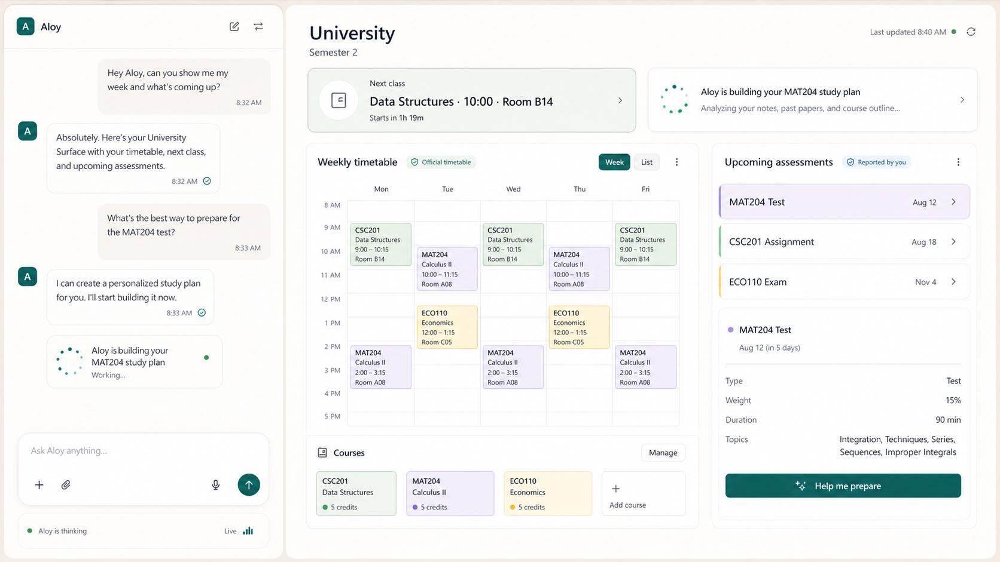
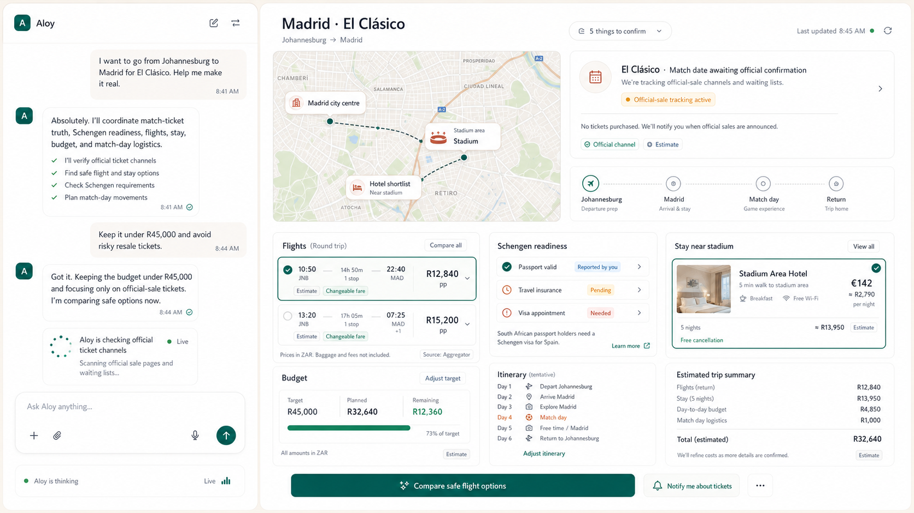

# Aloy Event Surface — model-authored application specification

_Version 2.1, 2026-07-21. This specification defines the Event Surface named
in [`aloy-vision.md`](./aloy-vision.md). It supersedes the 2026-07-15 typed-block
composition proposal before that runtime was committed._

## 1. Decision

An **Event Surface is a durable, live, model-authored application for one
Event**. Aloy writes and evolves its React source. The user and Aloy interact
with the application through an Event-scoped SDK, while the generated code
runs outside Aloy's trusted application boundary.

The Surface is not:

- the Aloy webapp, desktop shell, or website as a whole;
- a fixed Event sidebar or a required set of Tasks/Files/Trail panels;
- a selection of predefined page templates;
- an opaque screenshot or chat response;
- a source of truth that can overrule Tasks, Proposals, receipts, artifacts,
  provider evidence, or the semantic Trail;
- generated code running inside Aloy's main React tree or authenticated origin.

The same runtime can produce a University operating workspace, a Madrid trip
planner, a Career OS research application, or an interface not anticipated by
the Aloy product code. Their shared contract is execution, data, interaction,
truth, and safety—not a shared visual schema.

## 2. Product north stars

These images are behavioral references, not implementation templates.

### 2.1 University Event



This proves that a Surface can:

- know a student's timetable, courses, tests, exams, and sources;
- accept meaningful selections such as “help me prepare”;
- show a durable Task working live without becoming a fixed Task dashboard;
- distinguish official timetable data from student-reported information;
- remain beside the Event's continuous Conversation;
- evolve when the student requests a grade calculator or a different layout.

### 2.2 Madrid El Clásico Event



This proves that a Surface can:

- combine a map, flights, visa readiness, hotel choices, budget, and itinerary;
- accept selections and feed them to the same Event Session;
- show estimates, user reports, official sources, and pending confirmation;
- avoid claiming a match ticket, booking, or payment without evidence;
- let Aloy continue checking or comparing options through durable work;
- request an external action through Proposal → decision → executor → receipt.

No individual panel shown in either image is mandatory. Aloy authored the
application because it fit that Event.

## 3. Workspace behavior

Conversation and Surface are peers inside an Event workspace:

```text
Event workspace
├── continuous Conversation
└── model-authored Surface application
```

The user controls three presentation modes:

1. **Conversation focus** — the generated application is hidden or minimized;
2. **Split** — Conversation and Surface are visible and resizable;
3. **Surface focus** — the generated application receives the main workspace.

When Aloy has produced a new successful Surface revision while the user is in
Conversation focus, the trusted conversation host may place a compact
**Surface ready** card immediately after Aloy's completed response. The card is
not authored by generated code and does not infer availability from assistant
prose. It is driven by successful build metadata, appears at most once per
unseen build revision, and opens Split on a suitable wide screen or Surface
focus on a narrow screen. Opening the Surface does not start a model turn or
add a semantic Trail entry.

On narrow screens they become explicit full-screen tabs or sheets. Live
updates must not steal focus, reset local interaction state, move scroll, or
silently replace the currently published application.

The Event owns one canonical continuous Conversation for its lifetime. Surface
interactions that require Aloy become structured turns in that same Session;
they do not create hidden competing conversations.

## 4. Two change loops

The implementation must keep application code and Event data separate.

### 4.1 Fast data and interaction loop

Most interactions do not rebuild the application:

```text
user interaction
→ local UI update or structured Surface intent
→ durable Event state / Aloy Run / Proposal
→ Event SSE update
→ running Surface reacts
```

Examples include selecting a hotel, reporting an assignment submitted,
requesting a study plan, shortlisting a company, or approving an action.
For work that outlives the request acknowledgement, the Surface follows the
accepted interaction record from queued or approval state to its terminal Run
outcome or receipt. It does not infer completion from local React state.

### 4.2 Slower code-evolution loop

Requests that change capability or information architecture cause Aloy to edit
the Surface source:

```text
request new capability
→ read current source and revision
→ patch React/CSS/manifest
→ isolated build and validation
→ preview and smoke test
→ atomically publish a new immutable revision
```

“Change the exam date” is a data update. “Add a grade calculator” is a code
change. A failed build never replaces the last working revision.

## 5. Model-authored project contract

V1 gives Aloy a small React project rather than an unrestricted full-stack app:

```text
surface/
├── surface.json
└── src/
    ├── Surface.tsx
    └── styles.css
```

`surface.json` declares:

- schema and SDK version;
- requested Event read capabilities;
- structured intent names and payload schemas;
- privileged widgets used by the application;
- responsive metadata and entry point;
- no secrets, tenant IDs, credentials, or provider tokens.

V1 imports are restricted to React, reviewed version-locked utilities, and
`@aloy/surface`. Arbitrary npm installation, dynamic remote modules, `eval`,
and unreviewed scripts are not allowed. Aloy remains free to author layouts,
components, CSS, local state, forms, filters, and interaction flows inside that
boundary.

## 6. Surface SDK and interaction contract

Generated code never calls Aloy's authenticated REST API directly. It uses a
versioned SDK exposed over a capability-scoped message bridge.

Illustrative API:

```tsx
const event = useEvent();
const academic = useSurfaceData("academic");
const tasks = useTasks({ relatedTo: "assessment_mat204" });

await dispatch("assessment.study_help_requested", {
  assessmentId: "assessment_mat204",
});
```

V1 SDK capabilities should cover:

- Event metadata and namespaced Surface data;
- tenant- and Event-scoped Tasks, artifact/file metadata, Proposals, receipts,
  and selected Trail data;
- reactive subscriptions to Event data revisions;
- `useSurfaceInteraction(id)` and controller lifecycle state for a command's
  host-owned Run, Proposal, execution, and terminal outcome;
- typed `useProposals()`, `useSurfaceApprovalState()`, `useReceipts()`, and
  `useTrail()` projections; generated code may explain these records and bind a
  visible approval-summary region, but never owns approval or execution
  controls;
- structured `dispatch(name, payload)` intents;
- `openResource(fileId)` for a host-owned Workbench viewer intent that creates
  no Run and exposes no storage URL to generated code;
- `askAloy(message, context, {resources})` for an explicit model turn with
  optional trusted Event-file references;
- `requestAction(action)` for host-validated consequential intent;
- trusted host widgets such as maps, file previews, approvals, and credential
  collection where generated code must not own the privileged implementation.

Every intent includes the Event, published code revision, data revision,
component/action identity, payload, actor, timestamp, and idempotency key. The
host validates the declared schema and current tenant/Event before persistence.

State intents declare their mutation semantics explicitly. `create` fails when
the key exists; `replace`, `merge`, and `delete` fail when it is missing; and
`upsert` creates on first save and replaces on later saves. `upsert` is for
singleton settings or preferences whose one Save action is valid in both the
empty and populated states. It must not hide a missing-record conflict for an
ordinary entity that the user intended to edit or delete.

### 6.1 Interaction classes

| class | examples | behavior |
|---|---|---|
| local presentation | open, filter, sort, change tab | stays in the iframe; no model call |
| durable selection | shortlist hotel, select course | persist immediately; notify Aloy when declared |
| reasoning request | compare flights, build study plan | append structured Session turn and start/resume a Run |
| external consequence | pay, book, send, cancel | create a Proposal; require decision and receipt |
| application change | add grade calculator, redesign trip view | run the source/build/publish loop |

The model must not be invoked for every mouse movement or presentation-only
interaction. Meaningful user choices must not disappear into iframe-local
state.

Reasoning intents declare a reviewed, human-readable label. A Surface control
creates a first-class lifecycle card in the permanent Event conversation using
that label; it never creates a synthetic user bubble containing a command id,
hook name, or worker instruction. Safe status and recovery copy remain
user-facing, while retry exhaustion, provider errors, Run envelopes, and other
diagnostics remain in trusted Trail/operator evidence.

When a reasoning interaction wakes Aloy, the trusted Run envelope contains the
interaction ID and canonical snapshot identity but not a model-trusted copy of
the generated UI payload. Aloy must call `surface_interaction_read` with that
ID. The tool re-authorizes tenant, user, and Event scope, returns the exact
accepted interaction, and labels its payload `untrusted_input`. Canonical
mutable state is read separately. This preserves both useful selection context
and the prompt-injection boundary.

Successful resolution writes a durable, Run-bound context-read receipt on the
interaction. Worker completion fails closed unless the receipt matches the
originating interaction and Run. The completion gate reads the durable receipt
as well as current-process instrumentation so safe checkpoint resume works
across worker crashes. A model answer without that proof becomes a failed
interaction with retry guidance and cannot publish artifacts as if it used the
selection.

## 7. Truth, evidence, and consequences

Generated presentation cannot upgrade the posture of a claim. Canonical
records and evidence remain authoritative.

Examples:

- a user clicking “I paid” records `user_reported_paid`;
- Aloy clicking a provider tool records `pending` until execution resolves;
- a receipt permits `paid_verified` or another committed status;
- an uncertain crash window produces `indeterminate`, never a confident paid;
- a flight price without a current provider response remains an estimate;
- a map marker or selected hotel is not a booking.

The SDK supplies provenance and posture so generated code can label official,
user-reported, inferred, estimated, pending, committed, failed, and
indeterminate information. Security and truth enforcement live in the host,
not in skill instructions or generated source.

## 8. Authoring tools and Surface Builder skill

The runtime needs product tools similar to:

```text
surface_read_project
surface_write_files(expected_revision, idempotency_key, patches)
surface_build
surface_preview
surface_publish(expected_revision)
surface_rollback
```

Tools derive tenant, user, and Event identity from the authenticated Run. Source
mutation, builds, and publishing are optimistic and idempotent. Publishing is
atomic and produces a semantic Trail entry.

An Aloy **Surface Builder** skill is also required, but it is guidance—not the
security boundary. It teaches:

- the project and SDK contract;
- responsive and accessible UI construction;
- how to classify interactions;
- truth and consequence presentation;
- how to inspect build errors, preview, and repair;
- how to evolve an application without destroying durable Event data;
- University, Madrid, and future showcase templates as portable seeded Surface
  projects rather than domain logic embedded in the runtime.

### 8.1 Product-owned authoring profiles

Surface intelligence is configured by Aloy's developer/operator, not by the
end user. A user requests an outcome; Aloy selects immutable, versioned
**Builder**, optional **Critic**, and **repair** profiles. Each profile binds its
provider/model, required capabilities, prompt and skill versions, tool policy,
fallbacks, and time/token/cost/attempt budgets. The exact profile versions are
recorded with every candidate and evidence receipt so upgrades are measurable
and failures reproducible. End users never configure model names, reasoning
levels, system skills, privileged tools, or publication policy.

The Builder can author and repair but cannot approve its own work. An optional
independent Critic can read bounded evidence but cannot mutate source or
publish. Host-enforced schemas, compiler rules, CSP, SDK capabilities, tests,
and publication receipts remain authoritative even when a profile or skill is
wrong.

Critical rules must also be enforced by tools, schemas, the compiler, CSP, and
the host bridge because an optional skill cannot be trusted as a sandbox. The
quality and publication gate is defined in §13 below; a successful build is
necessary but is not sufficient to publish a revision.

## 9. Build and runtime isolation

Generated code must never execute in Aloy's trusted React tree.

### 9.1 Build boundary

- compile in an Aloy-managed isolated build sandbox;
- use a fixed toolchain and lockfile owned by Aloy;
- reject undeclared imports, dynamic code loading, oversized output, and known
  dangerous constructs;
- apply CPU, memory, file-count, source-size, and wall-clock limits;
- retain build logs and a content checksum;
- do not expose backend or provider secrets to the build;
- publish immutable bundles only after validation succeeds.

The V1 runtime bundle contract is intentionally smaller than a general web
archive. A successful fixed-toolchain build emits a ZIP containing exactly a
self-contained `surface.js` and, optionally, `surface.css`. It cannot provide
its own HTML shell, CSP, external assets, nested paths, or runtime dependencies.
The host rejects duplicate, encrypted, unknown, non-UTF-8, and oversized
entries before constructing a runtime document. This keeps the security
boundary owned by Aloy even when generated source contains hostile strings.

### 9.2 Browser boundary

- serve the bundle in a sandboxed iframe on a separate/opaque origin;
- apply a strict CSP and deny direct network access by default;
- deny host cookies, local storage, top navigation, popups, downloads, and
  device APIs unless a reviewed host capability explicitly supplies them;
- communicate over a bound `MessageChannel` with validated message schemas;
- use iframe bounds and host-owned chrome so generated UI cannot impersonate
  Aloy authentication, approvals, or credential collection;
- isolate failures and apply heartbeat, render-time, and resource watchdogs;
- keep a visible recovery action and the last-good revision.

During pre-publication preview, the authenticated app fetches the selected
immutable build as a host-constructed document and navigates a Blob URL inside
an iframe with `sandbox="allow-scripts allow-forms"` and no
`allow-same-origin`. `allow-forms` permits React submit events; the host-owned
runtime still enforces `form-action 'none'`, so generated forms cannot navigate
or transmit data directly and must use the typed Aloy bridge. The
document repeats the strict CSP in a leading meta element because fetch-time
response headers do not carry over to Blob navigation. No bearer token,
object-store reference, source tree, or build log enters the iframe. This
preview path is not publication. The host now binds each `MessageChannel` to a
fresh session id and does not report the runtime healthy until the generated
SDK acknowledges that exact session. Context and interaction calls have
bounded timeouts. Host heartbeats detect an unresponsive runtime, while the
SDK safely replays at most once after a retryable failure or reconnect using
the original interaction idempotency key. The host keeps the existing iframe
visible during bounded reconnect attempts and exposes an explicit manual
recovery action if those attempts are exhausted. Last-good publication and
the broader render/resource watchdog gate remain separate work.

Privileged widgets remain host-reviewed. For example, a `Map` SDK component may
use a configured map adapter or controlled proxy with attribution, privacy
disclosure, credential isolation, and a coordinate-list fallback. Generated
code supplies locations and labels, not provider credentials or arbitrary
network requests.

## 10. Persistence model

R5 should introduce these durable concepts:

- `surface_projects`: one Event-owned project, current published revision,
  draft revision, SDK version, lifecycle, and user lock state;
- `surface_revisions`: immutable manifest and source snapshots, creator Run,
  parent revision, checksum, and created time;
- `surface_builds`: revision, status, diagnostics, bundle reference, resource
  metrics, validation result, and timestamps;
- `surface_interactions`: Event/session ownership, code/data revisions, name,
  validated payload, actor, idempotency key, handling Run, and status;
- `surface_data_records`: namespaced Event-owned JSON records with schema,
  revision, actor, posture, provenance, evidence references, and timestamps;
- per-user workspace preferences such as mode and split ratio, stored apart
  from semantic Event truth.

Code revision and data revision are independent. A new timetable row should
not republish the app; a redesigned app should not rewrite timetable truth.

## 11. API and live transport shape

Illustrative host endpoints:

```text
GET  /v1/events/{event_id}/surface/project
GET  /v1/events/{event_id}/surface/bundle
GET  /v1/events/{event_id}/surface/data
GET  /v1/events/{event_id}/surface/runtime
GET  /v1/events/{event_id}/surface/publications
POST /v1/events/{event_id}/surface/rollback
POST /v1/events/{event_id}/surface/interactions
GET  /v1/events/{event_id}/surface/interactions/{interaction_id}
PATCH /v1/events/{event_id}/surface/preferences
```

Authoring routes should be internal product-tool boundaries rather than public
model-chosen tenant APIs. R4 Event SSE carries code revision, data revision,
interaction status, Task/Run changes, Proposal/receipt changes, and reconnect
invalidation. The iframe receives only the capabilities and data selected by
the host bridge.

## 12. Session and trigger behavior

An Event persists continuously; a model process does not run continuously.
Aloy wakes because of:

- a Conversation message;
- a meaningful Surface interaction;
- explicit Task execution;
- a configured schedule or incoming-data trigger;
- clarification, approval, or provider reconciliation;
- an explicit application-change request.

Surface-generated reasoning turns use the Event's canonical Conversation and
retain the originating interaction as provenance. Presentation-only events do
not pollute the transcript. Background completion updates both Conversation
and Surface through the existing durable Event transport.

## 13. Quality and publication gate

Surface quality is an engineered gate, not a prompt adjective. Every material
revision follows this bounded loop:

```text
understand Event → write brief → generate/patch → isolated build
→ render required states → deterministic audit → evidence receipt
→ simulate primary user jobs → repair → publish or retain last-good
```

### 13.1 Brief and design system

Before code, Aloy records the Surface goal, primary user jobs, important
entities, visual priority, primary actions, declared intents, truth/evidence
requirements, required states, viewports, user pins, preferences, and non-goals.
This prevents generic dashboard generation.

Generated applications use `@aloy/surface` tokens and low-level primitives for
typography, spacing, layout, inputs, panels, states, provenance, money, dates,
maps, timelines, files, and approvals. These are safe building materials, not
fixed Event templates. The University and Madrid images in §2 are golden
references for Aloy's warm, calm, legible, information-dense visual language.

### 13.2 Required evidence

Every candidate renders wide desktop, laptop, default and narrow split,
tablet, and mobile views. It also renders loading, empty, stale/offline, error,
permission-denied, pending, indeterminate, dense long-content, and protected
approval-required states when applicable. Approval scenarios use ordinary
pending Proposal and `waiting_approval` Interaction truth; they never expose
generated approval controls or an inspection-only switch. The five baseline
viewport screenshots remain build artifacts; state compositions retain compact
host-signed DOM, accessibility, contrast, and layout fingerprints instead of
multiplying image storage and latency.

Deterministic checks block publication for build/runtime errors, undeclared or
dead intents, accessibility failures, overflow, broken focus, poor contrast,
missing states, unauthorized capabilities, truth/provenance violations,
non-idempotent meaningful interactions, or Proposal-rail bypass.

An optional vision-capable **Surface Critic** may later evaluate selected
representative captures asynchronously for hierarchy, density, action clarity,
and polish. It is advisory, is not required for V1 publication, and can never
publish, block last-good recovery, or waive deterministic security or truth
gates. Aloy should add it only if measured Builder quality justifies its cost
and latency.

### 13.3 User-job simulation

The University proof must let a user find the next class, understand upcoming
assessments, inspect provenance, request MAT204 help, report submission without
claiming LMS confirmation, and later add a grade calculator without data loss.

The Madrid proof must let a user track the R45,000 target, distinguish official
from unconfirmed tickets, compare ZAR flight options, select a hotel exactly
once, understand visa readiness, and route booking/payment through Proposal and
receipt.

Tests simulate keyboard and pointer paths, validate intent payloads, assert
durable results, and confirm live updates. A visually attractive screenshot is
not sufficient when the primary jobs fail.

### 13.4 Repair, user control, and publication

The Builder receives structured findings and may repair within bounded attempt,
time, and cost budgets. Exhaustion keeps the current Surface active and leaves
the failed draft and diagnostics inspectable. Users may request targeted
changes, pin accepted regions, preview or reject a redesign, mark a view not
useful, and restore any last-good revision. Explicit feedback updates the brief;
one ambiguous click does not authorize a permanent redesign.

Pinning and usefulness feedback are host-owned, revision-bound controls.
Generated applications label visible regions with stable semantic ids such as
`next-class` or `budget-summary`; ids describe purpose, not DOM position. A pin
stores the Event, route, region, accepted revision/build, purpose, important
content/actions, note, and provenance outside generated code. Future briefs
treat it as a semantic preservation constraint: styling and responsive layout
may improve, but removing its purpose or important action blocks publication
until the user accepts the redesign or removes the pin.

**This view is not useful** records the exact build, route, region, viewport,
state, reason, and optional note. It becomes a measurable requirement for the
next candidate but does not immediately rewrite or unpublish the live Surface.
The user may request repair now, leave it for a later improvement, resolve it,
or dismiss it. Generated code cannot forge, hide, intercept, or submit either
control.

The publish service—not the Builder or Critic—atomically publishes only when:

- every hard gate and primary user job passes;
- the candidate still descends from the expected current revision;
- last-good recovery is available.

The live pointer identifies both the immutable source revision and the exact
validated build artifact. A merely successful draft build never replaces the
live Surface. Publication reopens and verifies the retained bundle and checksum
before one compare-and-set transaction advances the pointer, appends an
idempotent publication record, and writes semantic Trail. Rollback is another
append-only publication event targeting a build that was previously live; it
does not rewrite revision history or Event data. The Workbench resolves only
this published pointer and keeps the current iframe mounted when a draft build,
publication, or recovery attempt fails.

Scores cover user-job success, interaction/state quality, hierarchy and
legibility, Event specificity, accessibility/responsiveness, truth/provenance,
performance, and resilience. A high score never overrides a failed hard gate.

## 14. Acceptance gate

The model-authored Surface runtime is ready when:

1. one model-authored University application can render timetable, courses,
   assessments, provenance, and a study-help intent from Event data;
2. one independently authored Madrid application can render a map, flights,
   Schengen readiness, hotel choice, budget, itinerary, uncertainty, and a
   safe comparison intent through the same SDK/runtime;
3. both are installable showcase templates that use the same ordinary Event,
   source revision, build, SDK, interaction, and publication paths as any other
   Surface, with no domain-specific branch in Aloy's host or backend;
4. presentation interactions remain local while meaningful selections persist
   and reasoning intents reach the canonical Event Session exactly once;
5. external actions cannot bypass Proposal → decision → executor → receipt;
6. user reports, estimates, pending work, receipts, and indeterminate outcomes
   remain visibly and durably distinct;
7. invalid imports, direct network calls, cross-Event reads, host API access,
   cookie/storage access, top navigation, and escape attempts fail closed;
8. a failed or crashing build/runtime preserves and can restore the last-good
   published revision;
9. data updates do not require code rebuilds, and code updates do not destroy
   Event data or local user focus;
10. Conversation focus, resizable split, Surface focus, reconnect, keyboard,
    accessibility, and narrow-screen behavior pass interaction QA;
11. the deterministic gate, rendered critique, user-job suites, bounded repair,
    user controls, and last-good publication policy in §13 pass.

### 14.1 Showcase-template role

University ships first as the onboarding and continuity demonstration. Its
seeded application includes navigation, timetable, courses, exams and tests,
and study actions. Madrid ships second as the rich planning and trust
demonstration, after the dedicated host-widget phase provides Map and other
reviewed primitives; it includes flights, hotels, visa readiness, budget,
itinerary, and protected payment intent.

Templates may provide source, manifest, sample Event records, guided prompts,
and expected user-job tests. They may not add template-only SDK methods,
privileged access, host components, database tables, or conditionals such as
`event.type === "university"`. Installing one creates normal tenant-owned
records and immutable Surface revisions. A template can therefore teach and
market Aloy while remaining honest evidence that the general platform works.
